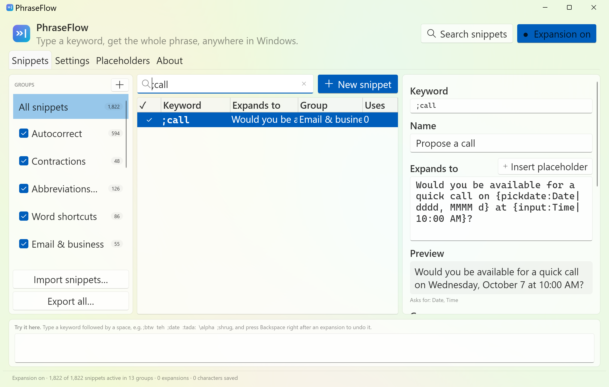
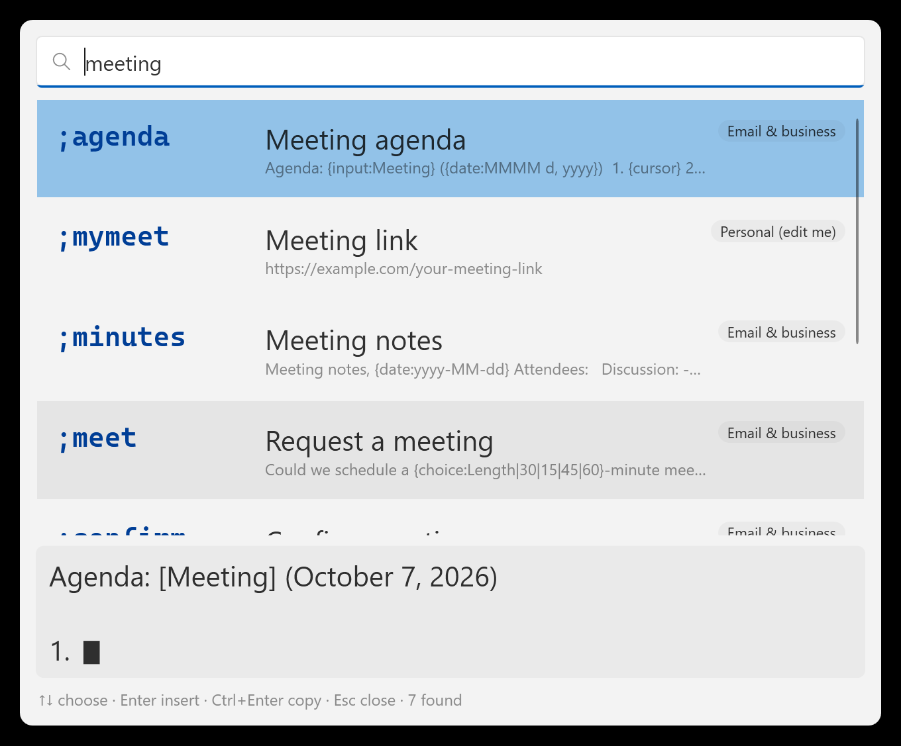

# PhraseFlow

**A fast, modern text expander for Windows.** Type a short keyword such as `;btw`, `teh` or `:tada:` and PhraseFlow replaces it with the full phrase, corrected word or emoji, in any application. Snippets can contain dynamic content (dates, the clipboard, fill-in forms, calculations, key presses…), and a Windows 11-style manager lets you organise them.



PhraseFlow ships with **1,822 ready-to-use snippets** in 13 groups and is built with a modern toolchain: **.NET 10, WPF with the Windows 11 Fluent theme (Mica, light/dark), CommunityToolkit.Mvvm, source-generated P/Invoke (`LibraryImport`), xUnit v3 on Microsoft.Testing.Platform, central package management and an `.slnx` solution**.

## Highlights

| Feature | What it does | Inspired by |
| --- | --- | --- |
| Keyword expansion everywhere | Global keyboard hook; works in browsers, Office, editors, chat apps, terminals | all expanders |
| Trigger modes | *After a trigger key* (space, Tab, Enter, punctuation), *immediately*, or *picker only* per snippet; configurable trigger characters | AutoHotkey, espanso, TextExpander |
| Word boundaries | `teh` is fixed, but `steh` is left alone; optional "expand inside words" | espanso `word`, AutoHotkey `?` |
| Case propagation | `btw` → by the way, `Btw` → By the way, `BTW` → BY THE WAY | espanso `propagate_case`, AutoHotkey |
| Dynamic content | 39 placeholders: dates with offsets and business days, time, clipboard, cursor position, fill-in fields, nested snippets, text transforms, counters, calculator, GUIDs, key presses, delays, scripts | TextExpander, PhraseExpress, Text Blaze, Beeftext |
| Fill-in forms | Text, multi-line, drop-down, checkbox and date-picker fields with live preview | TextExpander, PhraseExpress, espanso forms |
| Search picker | <kbd>Ctrl</kbd>+<kbd>Alt</kbd>+<kbd>Space</kbd> opens a searchable list; Enter inserts, Ctrl+Enter copies | Beeftext, espanso, TextExpander |
| Backspace undo | Press Backspace right after an expansion to get the typed text back | espanso `undo_backspace` |
| Smart insertion | Short text is typed; long or multi-line text is pasted and your clipboard is restored and kept out of clipboard history | espanso backends |
| Keeps up with fast typing | Keys typed while an expansion is being inserted are held and replayed in order | AutoHotkey SendInput |
| App rules | Global exclusion list (password managers by default) and per-group "only in" / "all except" app filters | espanso app configs, PhraseExpress |
| Groups | Enable/disable groups, bulk-change keyword prefixes, move snippets between groups | Beeftext, TextExpander |
| Import/export | PhraseFlow JSON, CSV/TSV (TextExpander), AutoHotkey hotstrings, espanso YAML, Beeftext JSON; export to JSON, CSV or AutoHotkey | — |
| Safety nets | Automatic backups, restore defaults, portable mode, pause hotkey, tray icon | — |

## Getting started

1. Download a release zip from CI (or build it, see below) and run `PhraseFlow.exe`.
   * `PhraseFlow-…-win-x64.zip` / `win-arm64.zip`: single self-contained exe, nothing else to install.
   * `PhraseFlow-…-framework-dependent.zip`: small download, requires the [.NET 10 Desktop Runtime](https://dotnet.microsoft.com/download/dotnet/10.0).
2. The manager window opens. PhraseFlow keeps running in the notification area when you close it; use the tray icon to reopen, pause or exit.
3. Try it in the **Try it here** box at the bottom of the window, or anywhere else: `;btw␣`, `teh␣`, `;date␣`, `:rocket:`, `\alpha␣`, `;shrug␣`.
4. Edit the **Personal (edit me)** group with your own email, phone and address; `;sig` and other snippets reuse them.
5. Optional: enable **Start PhraseFlow when I sign in to Windows** in Settings.

Command-line options: `--minimized` (start in the tray; used by the sign-in shortcut) and `--exit` (ask a running instance to quit).

### Creating snippets

Click **New snippet**, type a keyword and the text it should expand to. Recommended keyword styles:

* A prefix that never occurs in normal words, e.g. `;addr`, `;sig` (the built-in library uses `;`). Use **Change keyword prefix…** on a group to switch it to something else, e.g. `//`.
* Plain words for autocorrect-style fixes (`teh` → `the`), which only expand as whole words.
* Shortcodes ending in a character, e.g. `:smile:`, set to expand **immediately**.

Per-snippet options: trigger mode, letter case handling, insertion method (automatic, typing or clipboard), expand inside words, do not re-type the trigger key, plain text (no placeholders), enabled.

## Dynamic content (placeholders)

Placeholders use braces: `{name}` or `{name:argument|argument}`. They can be nested (`{upper:{clipboard}}`). Unknown names are left untouched, so code containing braces is safe; write `\{date}` to output a literal placeholder. Inside arguments, `\|`, `\{`, `\}` and `\\` are escapes. Use **Insert placeholder** in the editor or see the **Placeholders** tab for live examples.

| Placeholder | Example | Result |
| --- | --- | --- |
| `{date}` `{date:format}` `{date:format\|shift}` | `{date:dddd, MMMM d, yyyy}` | Wednesday, October 7, 2026 |
| date shifts | `{date:yyyy-MM-dd\|+3bd}` `{date:MMM d\|eom}` | +1d, -2w, +1M, +1y, +3bd (business days), som/eom, sow/eow, soy/eoy |
| `{time}` `{datetime}` `{utc}` | `{time:HH:mm\|+2h}` | 15:45 |
| `{week}` `{quarter}` `{unix}` `{ordinal:n}` | `{date:MMMM} {ordinal:{date:%d}}` | October 7th |
| `{clipboard}` | `[{cursor}]({clipboard})` | Markdown link to the copied URL |
| `{cursor}` | `<b>{cursor}</b>` | caret ends between the tags |
| `{input:Label\|default}` `{paragraph:Label}` | `Hi {input:Name},` | asks for a name first |
| `{choice:Label\|A\|B}` `{checkbox:Label\|on\|off}` `{pickdate:Label\|format}` | `Priority: {choice:Priority\|High\|Low}` | drop-down in the fill-in form |
| `{snippet:keyword}` | `{snippet:;sig}` | inserts another snippet |
| `{upper:…}` `{lower:…}` `{title:…}` `{trim:…}` `{slug:…}` `{urlencode:…}` | `{slug:Fix Login Bug #42}` | fix-login-bug-42 |
| `{replace:text\|find\|with}` `{repeat:text\|n}` | `{replace:{clipboard}\|\n\| }` | clipboard on one line |
| `{user}` `{fullname}` `{computer}` `{ip}` `{env:VAR}` | `{user}@{computer}` | jane@WORKSTATION |
| `{guid}` `{random:1\|6}` `{random:a\|b\|c}` `{counter:name}` | `Ticket #{counter:ticket\|0000}` | Ticket #0001, #0002, … |
| `{calc:expr\|format}` | `{calc:3*19.99*1.08\|0.00}` | 64.77 |
| `{key:Name\|n}` `{enter}` `{tab}` `{delay:ms}` | `user{tab}pass{enter}` | fills a login form |
| `{shell:cmd}` `{powershell:cmd}` | `{powershell:(Get-Date).DayOfYear}` | 280 (opt-in in Settings → Advanced) |

## Built-in library (1,822 snippets)

| Group | Snippets | Examples |
| --- | ---: | --- |
| Autocorrect | 594 | `teh` → the, `recieve` → receive, `definately` → definitely, `monday` → Monday |
| Contractions | 48 | `dont` → don't, `im` → I'm, `youre` → you're |
| Abbreviations & acronyms | 126 | `;btw`, `;afaik`, `;eod`, `;asap`, `;tldr`, `;lgtm` |
| Word shortcuts | 86 | `;approx` → approximately, `;w/o` → without, `;info` → information |
| Email & business | 55 | `;br`, `;sig`, `;followup` (form), `;oooreply`, `;standup`, `;invoice` (counter) |
| Date & time | 39 | `;date`, `;isodate`, `;today`, `;tomorrow`, `;nextbd`, `;eomdate`, `;week` |
| Symbols & special characters | 166 | `;->` →, `;!=` ≠, `;deg` °, `;euro` €, `;1/2` ½, `;tm` ™, `;nbsp` |
| LaTeX-style math & Greek | 136 | `\alpha` α, `\Delta` Δ, `\infty` ∞, `\leq` ≤, `\rightarrow` → |
| Emoji | 422 | `:smile:` 😄, `:+1:` 👍, `:tada:` 🎉, `:rocket:` 🚀, `:fire:` 🔥 |
| Text faces | 32 | `;shrug` ¯\\_(ツ)_/¯, `;tableflip` (╯°□°)╯︵ ┻━┻ |
| Developer | 58 | `;uuid`, `;todo`, `;cl` console.log, `;pymain`, `;feat`/`;fix` commits, `;prdesc`, regexes, `;mit` |
| Markdown & HTML | 46 | `;code`, `;mdtable`, `;mdlink`, `;ghnote`, `;details`, `;readme` |
| Personal (edit me) | 14 | `;myemail`, `;myphone`, `;myaddr`, `;mylinkedin` |

Groups can be disabled with one click, and **Settings → Restore default snippets** brings back anything you deleted without overwriting your edits.

## Search picker

Press <kbd>Ctrl</kbd>+<kbd>Alt</kbd>+<kbd>Space</kbd> (configurable) anywhere. Type to search keywords, names and text; results are ranked (keyword matches first, frequently used snippets break ties) and previewed. <kbd>Enter</kbd> inserts into the app you were using, <kbd>Ctrl</kbd>+<kbd>Enter</kbd> copies to the clipboard, <kbd>Esc</kbd> closes.



## Import and export

* **Import** (Snippets → Import snippets…): PhraseFlow/Beeftext JSON, CSV/TSV with or without a header (TextExpander exports, spreadsheets), AutoHotkey `.ahk` hotstrings (options `*`, `?`, `C`, `C1`, `O`, continuation sections, `{Enter}`-style keys), espanso `.yml` match files (triggers, `word`, `propagate_case`, `$|$`, date/clipboard/shell/choice/random/echo/form variables). Groups with the same name are merged and duplicates skipped; a backup is made first.
* **Export**: whole library or a single group as PhraseFlow JSON, CSV or AutoHotkey v2 hotstrings.

## Settings and data

* Trigger keys, undo, insertion method and clipboard timing, typing delay for slow apps, picker and pause shortcuts, excluded applications, theme, sound, notifications and sign-in start.
* Data lives in `%APPDATA%\PhraseFlow` (`library.json`, `settings.json`, `Backups\`, `phraseflow.log`). Create an empty `portable.txt` next to `PhraseFlow.exe` to keep everything in a `Data` folder beside the exe instead.
* Backups are made automatically (at most every 12 hours and before risky operations) and can be restored from Settings.

## Building from source

Requirements: Windows 10/11 and the [.NET 10 SDK](https://dotnet.microsoft.com/download/dotnet/10.0).

```powershell
dotnet build PhraseFlow.slnx
dotnet test --project tests/PhraseFlow.Core.Tests/PhraseFlow.Core.Tests.csproj   # 171 unit tests
dotnet run --project src/PhraseFlow.App/PhraseFlow.App.csproj
./build.ps1          # tests + self-contained single-file zips (x64, ARM64) + framework-dependent zip in .\dist
```

An interactive end-to-end test drives the real hook: it starts PhraseFlow in portable mode with the built-in library plus a few test snippets, types into its own window with `SendInput` (only while that window is in the foreground) and verifies 22 scenarios, including forms, the picker, clipboard restore, backspace undo and keys typed during slow (delayed or scripted) expansions:

```powershell
dotnet build tests/PhraseFlow.E2E
tests/PhraseFlow.E2E/bin/Debug/net10.0-windows/PhraseFlow.E2E.exe src/PhraseFlow.App/bin/Debug/net10.0-windows/PhraseFlow.exe
```

The GitHub Actions workflow in `.github/workflows/ci.yml` builds, runs the unit tests and uploads the packaged zips.

## Architecture

```
src/PhraseFlow.Core     net10.0, UI-free: models, placeholder parser/evaluator, reverse-trie keyword index,
                        typing engine, JSON storage, import/export, embedded default library (Library/*.json)
src/PhraseFlow.App      net10.0-windows WPF app: low-level keyboard/mouse hook, SendInput injection,
                        Win32 clipboard, hotkeys, tray icon, MVVM views
tests/PhraseFlow.Core.Tests   xUnit v3 unit tests (parser, evaluator, matching, importers, library integrity)
tests/PhraseFlow.E2E          interactive end-to-end harness
tools/                  icon generator and UI screenshot helpers
```

* A dedicated high-priority thread owns the `WH_KEYBOARD_LL`/`WH_MOUSE_LL` hooks. Keys are translated with the foreground window's keyboard layout (`ToUnicodeEx` without disturbing dead keys; AltGr and dead keys are handled) and fed to the typing engine, which checks the end of the typed text against a reversed-keyword trie, so each keystroke costs the same regardless of library size.
* When a keyword completes, the hook swallows that key and hands the match to a worker thread that evaluates placeholders, erases the keyword and types (`SendInput` with Unicode packets) or pastes the result. Keystrokes typed meanwhile are held and replayed afterwards so they stay in order. Clicks, navigation keys and window switches reset the context.
* The expansion is skipped if the caret may have moved (a click or window switch) before or during insertion. A watchdog releases held keys if an expansion stalls (the swallowed key is delivered first), and the clipboard is restored only if no other application changed it meanwhile.
* Injected input carries a signature so PhraseFlow never reacts to its own keystrokes.

## Limitations

* Windows does not let a normal process type into elevated (administrator) windows, so PhraseFlow leaves them alone; run PhraseFlow as administrator if you need expansion there.
* Expansion is suspended while an IME composition is active and in excluded applications. Some games and remote-desktop clients that read raw input may ignore simulated keys; increase the typing delay or switch the insertion method if an app drops characters.
* The built-in autocorrect, contraction and phrase lists are English; disable those groups if you write in other languages.

## Privacy

Keystrokes are examined in memory only to detect keywords. Nothing you type is logged, stored or sent anywhere; snippets are saved in a local JSON file.
